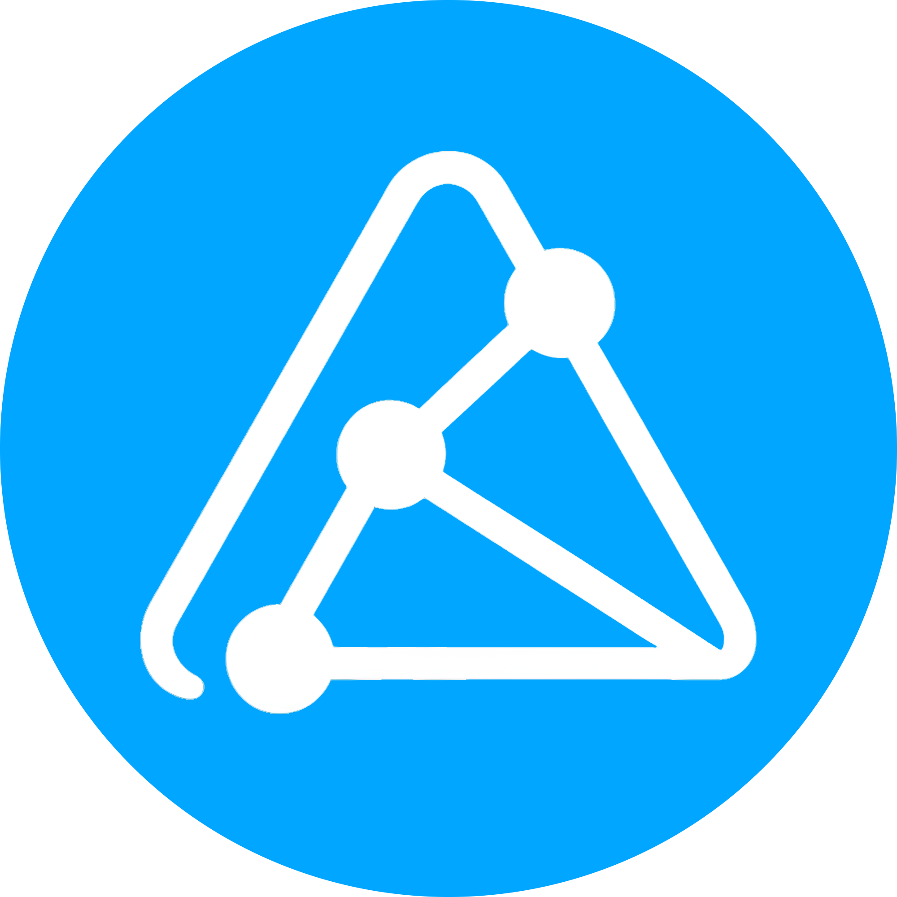

# A2Tonium Frontend 

## 🚀 Project Overview

**A2Tonium Frontend** is the user-facing interface of the decentralized education platform built on the TON Blockchain. It empowers **educators** and **students** to interact with blockchain-powered NFT courses and certificates seamlessly. The frontend enables course creation, enrollment, interactive learning, quiz submissions, and NFT certificate requests — all while leveraging decentralized technologies such as TON Blockchain and IPFS (Pinata).

Built with **React**, **TypeScript**, and **Tailwind CSS**, the frontend integrates with the TON Web3 SDK and TON Connect for smooth wallet interactions and blockchain transactions.

---

## 🎯 Key Features

- **NFT Course Creation:** Educators create courses as NFT Collections with metadata and materials stored on IPFS.
- **Secure Enrollment:** Students enroll by sending encrypted personal data and TON tokens to smart contracts.
- **Interactive Learning:** Access course videos, materials, and quizzes with encrypted answer submission.
- **NFT Certificate Requests:** Students request certificates minted as NFTs upon course completion.
- **Multi-language Support:** Supports English, Kazakh, and Russian locales.
- **Blockchain Integration:** Uses TON Web3 SDK and TON Connect for wallet connection and transactions.
- **Responsive Design:** Mobile-friendly UI optimized for various devices.

---

## 📁 Project Structure

```
src/
├── components/           # Reusable UI components (catalog, quizzes, profile, certificates)
│   ├── animated/
│   ├── catalog/
│   ├── certificate/
│   ├── coursePromo/
│   ├── footer/
│   ├── header/
│   ├── lesson/
│   ├── profile/
│   ├── quiz/
│   └── ui/
├── hooks/                # Custom React hooks for blockchain and app logic
├── pages/                # Application pages and routing
│   ├── catalog/
│   ├── certificate/
│   ├── coursePromo/
│   ├── learn/
│   ├── lesson/
│   ├── quiz/
│   ├── teach/
│   └── user/
├── services/             # API and blockchain interaction services
├── i18n/                 # Internationalization setup and locale files
├── layouts/              # Layout components (main layout, headers, footers)
├── lib/                  # Utility libraries (TON, IPFS, cryptography)
├── styles/               # Global styles (Tailwind CSS)
├── types/                # TypeScript type definitions
├── utils/                # Helper functions and utilities
└── main.tsx              # React app entry point
```

---

## 🛠️ Getting Started

### Prerequisites

- [Node.js](https://nodejs.org/) v18 or higher
- [npm](https://www.npmjs.com/) or [yarn](https://yarnpkg.com/)
- TON-compatible wallet (e.g., TON Wallet, TON Connect)

### Installation

```
git clone https://github.com/your-repo/a2tonium-frontend.git
cd a2tonium-frontend
npm install
# or
yarn install
```

### Running the Development Server

```
npm run dev
# or
yarn dev
```

Open your browser and navigate to [http://localhost:5173](http://localhost:5173) to access the app.

### Building for Production

```
npm run build
# or
yarn build
```

The build output will be in the `dist/` directory, ready for deployment.

---

## ⚙️ Configuration

### Environment Variables

Create a `.env` file in the root directory to configure environment-specific variables:

```
VITE_PINATA_JWT=your_pinata_jwt_token
VITE_TON_RPC=https://toncenter.com/api/v2/jsonRPC
VITE_TON_CONNECT_PROJECT_ID=your_ton_connect_project_id
```

- `VITE_PINATA_JWT`: JWT token for Pinata IPFS API to upload course materials.
- `VITE_TON_RPC`: RPC endpoint for TON blockchain interaction.
- `VITE_TON_CONNECT_PROJECT_ID`: Project ID for TON Connect wallet integration.

### Localization

Localization files are located in `public/locales/{en,kz,ru}`. You can add or update translations as needed.

---

## 🔗 Integration with Backend & Blockchain

- The frontend interacts with the **A2Tonium Backend** which processes blockchain events, manages course states, and grades quizzes.
- Blockchain interactions (enrollment, quiz submission, certificate requests) are handled via **TON Web3 SDK** and **TON Connect**.
- Course metadata and materials are uploaded to **IPFS (Pinata)** through the frontend.
- All critical data is stored on the TON Blockchain, ensuring transparency and immutability.

---

## 🧩 Usage

### For Educators

- Create courses by uploading metadata and materials.
- Deploy NFT Collection smart contracts.
- Manage quizzes and grade student submissions.
- Approve and issue NFT certificates.

### For Students

- Browse and enroll in courses by sending TON tokens.
- Access course materials and complete quizzes.
- Submit encrypted quiz answers securely.
- Request NFT certificates upon successful course completion.

---

## 📚 Technologies Used

| Technology         | Purpose                              |
|--------------------|------------------------------------|
| React              | UI library                         |
| TypeScript         | Type safety                        |
| Tailwind CSS       | Styling and responsive design      |
| Vite               | Build tool and development server  |
| TON Web3 SDK       | Blockchain interactions            |
| TON Connect        | Wallet connection and management   |
| Pinata IPFS        | Decentralized file storage         |
| i18next            | Internationalization               |

---

## 🤝 Contributing

Contributions are highly encouraged! Please follow these steps:

1. Fork the repository.
2. Create a new feature branch (`git checkout -b feature/your-feature`).
3. Commit your changes (`git commit -m 'Add some feature'`).
4. Push to the branch (`git push origin feature/your-feature`).
5. Open a Pull Request describing your changes.

Please ensure your code follows the existing style and includes tests where applicable.

---

## 🐛 Reporting Issues

If you encounter bugs or have feature requests, please open an issue in the GitHub repository with detailed information and reproduction steps.

---

## 📄 License

This project is licensed under the **MIT License**. See the [LICENSE](LICENSE) file for details.

---

## 🙌 Acknowledgments

- Thanks to the TON community for their open-source tools and documentation.
- Inspired by decentralized education initiatives worldwide.
- Special thanks to all contributors and early adopters.

---

## 📞 Contact

For questions or support, please reach out:

- GitHub Issues: https://github.com/your-repo/a2tonium-frontend/issues
- Email: support@a2tonium.org
- Telegram: [@a2tonium](https://t.me/a2tonium)

---

**Empowering decentralized education on TON Blockchain with A2Tonium!** 🚀

---